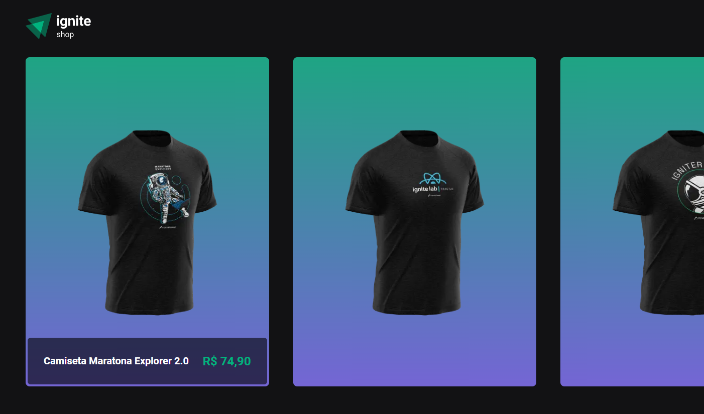

<p align="center">
  
</p>

<p align="center">
  <a href="#-technologies">Technologies</a>&nbsp;&nbsp;&nbsp;|&nbsp;&nbsp;&nbsp;
  <a href="#-project">Project</a>&nbsp;&nbsp;&nbsp;|&nbsp;&nbsp;&nbsp;
  <a href="#-layout">Layout</a>&nbsp;&nbsp;&nbsp;|&nbsp;&nbsp;&nbsp;
  <a href="#-screenshot">Screenshot</a>&nbsp;&nbsp;&nbsp;|&nbsp;&nbsp;&nbsp;
  <a href="#-how-to-run">How to run</a>&nbsp;&nbsp;&nbsp;|&nbsp;&nbsp;&nbsp;
  <a href="#-license">License</a>
</p>

<p align="center">
     
</p>

<br>

## 🧪 Technologies

This project was developed with the following technologies:

- [React](https://reactjs.org)
- [Next.js](https://nextjs.org/)
- [TypeScript](https://www.typescriptlang.org/)

## 🍺 Project

Ignite Shop is a simple shop for testing concepts of Next and integration with Stripe.

The project uses:

✔ React

✔ Next.js

✔ Stripe

✔ TypeScript

## 🔖 Layout

Figma Layou in [here](https://www.figma.com/file/iQc7gLfLMgoyVgv7Kq9ASF/Ignite-Shop?node-id=0%3A1).

## 🖼 Screenshot

<p align="center">
     
</p>

## 🚀 How to run

Clone the project and access its folder.

```bash
$ git clone https://github.com/thefalked/03-ignite-shop.git
$ cd 03-ignite-timer
```

To start it, follow the steps below:

```bash
# Install dependencies
$ yarn

# Start the project
$ yarn start
```

The app will be available in your browser on the address `http://localhost:3000`.

## 📝 License

This project is under the MIT license. See the [LICENSE](LICENSE) file for more details.
